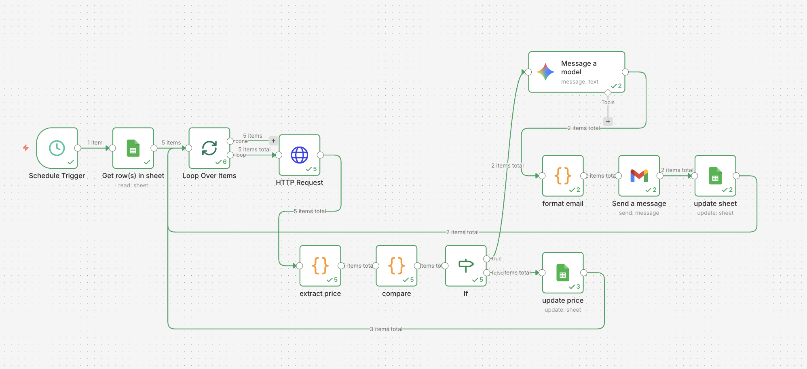

# Price AlertAgent — n8n + Gemini

An automated AI agent that monitors product prices and sends 
intelligent email alerts when prices drop below your target.

### Features
- Monitors multiple products simultaneously
- Scrapes live prices every 6 hours automatically
- AI-powered deal analysis using Google Gemini
- Sends formatted HTML email alerts on price drops
- Logs full price history in Google Sheets
- Branching logic — alerts only when price target is hit

### Tools & Technologies
- **n8n** — workflow automation
- **Google Gemini API** (free tier) — AI deal analysis
- **Google Sheets** — product watchlist + price history
- **Gmail** — price drop email alerts
- **HTTP Request** — live price scraping

### Workflow Architecture
1. Schedule Trigger — runs every 6 hours
2. Google Sheets — reads product watchlist
3. Loop Over Items — processes one product at a time
4. HTTP Request — scrapes live product page
5. Code node — extracts current price from HTML
6. Code node — compares vs target price
7. IF node — branches on price drop detected
8. Google Gemini — analyzes deal quality (true branch)
9. Code node — formats HTML email
10. Gmail — sends price drop alert
11. Google Sheets — updates price history + alert status
12. Google Sheets — logs price silently (false branch)

### How to Run
1. Import `workflow.json` into your n8n instance
2. Add your Google Gemini API key credential
3. Add your Gmail credential
4. Create a Google Sheet called "Product Watchlist" with columns:
   `product_name | url | target_price | last_price | last_checked | alert_sent`
5. Add products to your watchlist
6. Activate the workflow

### Screenshot

